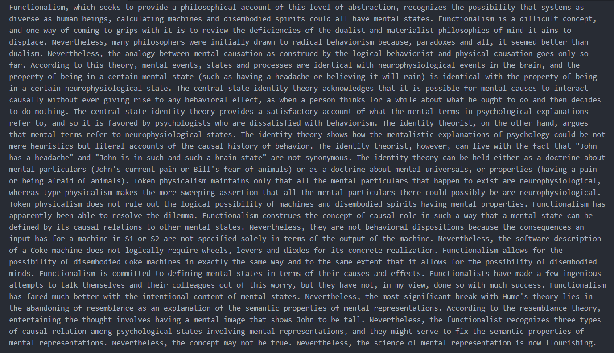

# pdf-summarizer

## About This Project

The idea for this project came from the fact that I wanted to summarize readings for my cognitive psychology class so that I could save time and still learn all the necessary information.

## How It Works

The script parses text from a user input PDF file and processes it by removing stop words and unnecessary characters. Every word is then normalized with a Porter2 stemmer and added to a word frequency table. The value of each sentence is calculated using the word frequencies, and only sentences that exceed the average sentence value by a certain factor are added into the summary.

Update: Added the option to use OCR to extract the text from the PDF file. This is a slower process because the pages need to be individually converted into images, but the results are more accurate and now scanned documents and books can be summarized!

## Current Goals

- Allow user to adjust degree of summarization using the Flesch-Kincaid readability test
- Resolve undefined behavior with certain PDF file formatting

## Demo

Below is a demo using one of the readings I was assigned:

Original Reading

Summarized Reading

Not bad!
